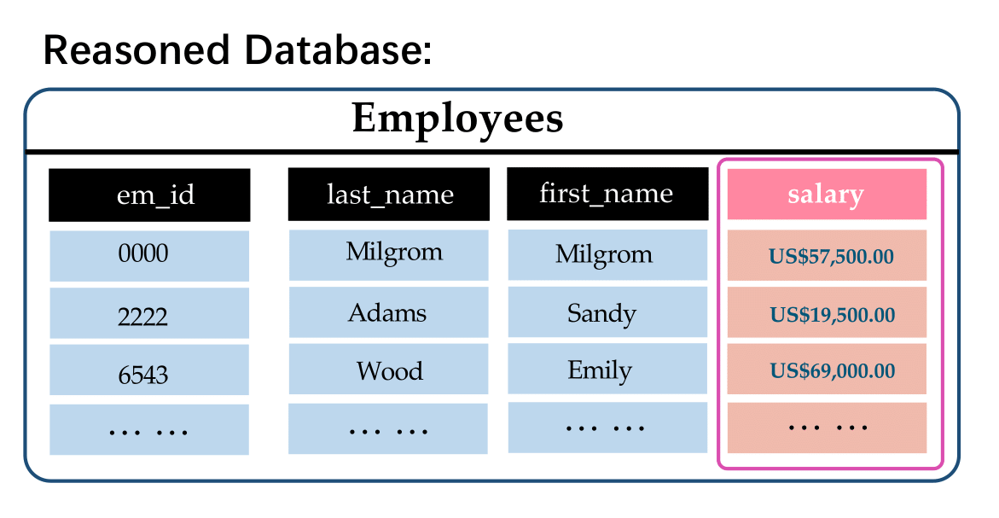
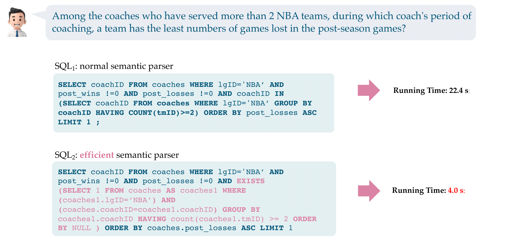

## About

BIRD (**BI**g Bench for **R**elational **D**atabase Grounded Text-to-SQL Evaluation) represents a pioneering, cross-domain dataset that examines the impact of extensive database contents on text-to-SQL parsing. The dataset includes three extra problems that especially resonates with real-world scenarios:

1. the necessity to incorporate external knowledge into parsers
2. the need for parsers to reason over 'dirty' values
3. the requirement to consider efficiency while executing SQLs.

BIRD contains over **16,000** unique question-SQL pairs, **98** big databases with a total size of **30.2 G**. It also covers more than **37** professional domains, such as blockchain, hockey, healthcare and education, etc.

[button:Paper](https://alibabaresearch.github.io/DAMO-ConvAI/bird/)

## Surprise from BIRD

1. **External Knowledge**: "account.type = 'OWNER'" can be inferred by the knowledge evidence: "The condition of the loans require the account type should be the owner."

2. **Large and Dirty values**: Due to the nature of the real-world scenarios from which BIRD's database values were collected, they typically retain their original and frequently "dirty" format. Hence, text-to-SQL parsers must first analyze these values to account for their non-standard format before engaging in reasoning.


3. **Text-to-Efficient-SQL**: BIRD is the first text-to-SQL benchmark designed to encourage semantic parsers to produce SQL queries that are not only correct but also efficient. This emphasis on efficiency is especially valuable in real-world data / business analysis circumstances.


## Download Dataset

We are cleaning and checking our databases, SQLs, Question, and Knowledge carefully. Will come up soon!

[button:Bird Code Nest](https://alibabaresearch.github.io/DAMO-ConvAI/bird/)

## Submission

We will update the newest and detailed tutorial of submission.

## Citation

If you use Bird in your research, please cite our paper by:

```text
@inproceedings{jin2019pubmedqa,
  title={PubMedQA: A Dataset for Biomedical Research Question Answering},
  author={Jin, Qiao and Dhingra, Bhuwan and Liu, Zhengping and Cohen, William and Lu, Xinghua},
  booktitle={Proceedings of the 2019 Conference on Empirical Methods in Natural Language Processing and the 9th International Joint Conference on Natural Language Processing (EMNLP-IJCNLP)},
  pages={2567--2577},
  year={2019}
}
```